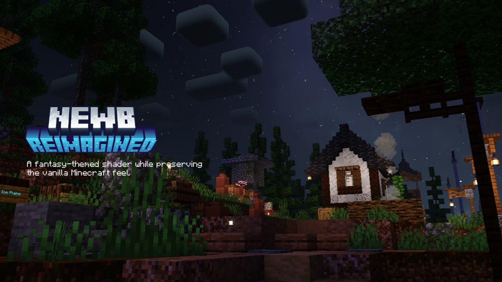

# Newb Reimagined

**Newb Reimagined** is a shader for Minecraft Bedrock, based on [Newb X Legacy](https://github.com/devendrn/newb-x-mcbe). 

It prioritizes soft lighting, less saturated colors, and a more aesthetic look. 
Inspired by Complementary Reimagined shader from Minecraft Java. 

Supports Minecraft Bedrock 1.26.30 (Android/Windows/iOS). Created by alvyrei.

 

 

## Downloads
[Latest Version](https://github.com/alyow/newb-reimagined/releases)

 

## More information about shader in Minecraft Bedrock
https://faizul726.github.io/blog/

 

## Installation

> [!NOTE]
> Shaders are not officially supported on Minecraft Bedrock. The following are unofficial ways to load shaders. There are multiple ways to get it working. Start with the recommended method. If that doesn't work try the other method.

### Android

| **Using MB Loader App** |
|:-|
| 1. Install [MB Loader App](https://play.google.com/store/apps/details?id=io.github.bambosan.mbloader) |
| 2. Launch Minecraft from MB Loader. |
| 2. Import the resource pack and activate it in global resources. |

### Windows

| **Using BRD Mod** |
|:-|
| 1. Use [BetterRenderDragon](https://github.com/QYCottage/BetterRenderDragon/releases/latest) to enable MaterialBinLoader. |
| 2. Import the resource pack and activate it in global resources. |

### Linux / Mac
This method is for [mcpelauncher-manifest](https://minecraft-linux.github.io/).

| **Using MaterialBinLoader mod (Recommended): x86_64 arch** |
|:-|
| 1. Install [mcpelauncher-materialbinloader-mod](https://github.com/CrackedMatter/mcpelauncher-materialbinloader/releases/latest). |
| 2. Import the resource pack and activate it in global resources. |

| **Using shaders mod: x86_64, x86, arm64, arm arch** |
|:-|
| 1. Download [mcpelauncher-shadersmod](https://github.com/GameParrot/mcpelauncher-shadersmod/releases/latest). |
| 2. Follow this [guide](https://faizul726.github.io/guides/shadersmodinstallation) to setup. |

### iOS
Using shaders on iOS is not very straightforward and not recommended for beginners.

| **Using Minecraft with Hynis** |
|:-|
| 1. Download Minecraft with Hynis IPA file from our [Discord server](https://discord.com/invite/newb-community-844591537430069279). |
| 2. Sideload it with your preferred sideloading tool. |
| 3. Import the resource pack and activate it in global resources. |

 

## License

**Source Code:** The "Newb Shader" source code is licensed under the MIT License. You are free to modify, distribute, and create derivative works based on the source code.

**Compiled Resource Packs (`.mcpack` files):** The compiled resource packs distributed by the "Newb Shader" project and its variant creators are copyrighted works with restrictions. See the `COPYRIGHT.txt` file within each resource pack for more information.
